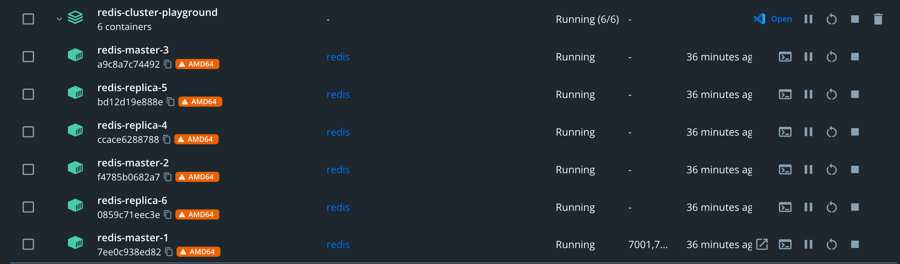
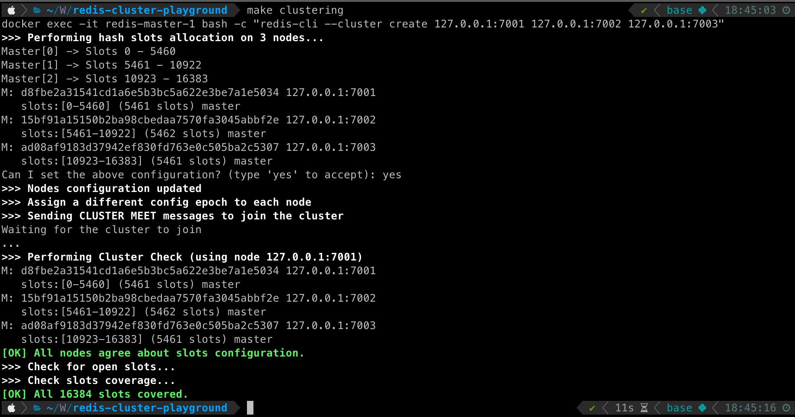
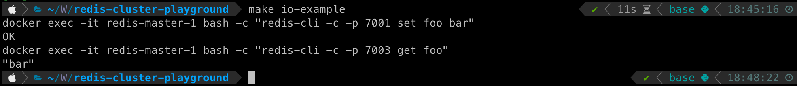

# Redis Cluster Playground

## Commands

```bash
make help

clustering           Run the clustering script.
help                 Show this help message.
inspect-redis        Inspect the redis container.
io-example           Run the io-example script.
run-redis            Run all redis container via docker-compose.
```

## Usage

```bash
make run-redis
```


after docker-compose run redis, you can check redis container status.

```bash
make inspect-redis
redis-cli --cluster create 127.0.0.1:7001 127.0.0.1:7002 127.0.0.1:7003


# or just..
make clustrering # and type yes
```



Now all of redis-master-1, redis-master-2, redis-master-3 are in the cluster.

```bash
docker exec -it redis-master-1 bash -c "redis-cli -c -p 7001 set foo bar"
docker exec -it redis-master-1 bash -c "redis-cli -c -p 7003 get foo"

# or just..
make io-example
```



Done. Easy huh?
